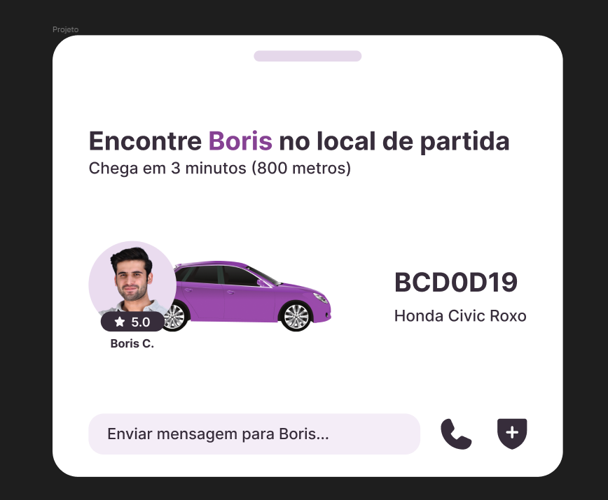
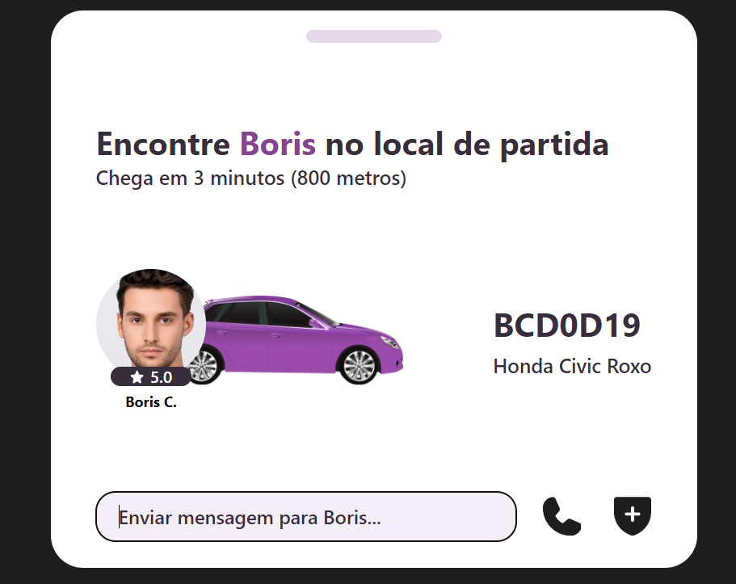
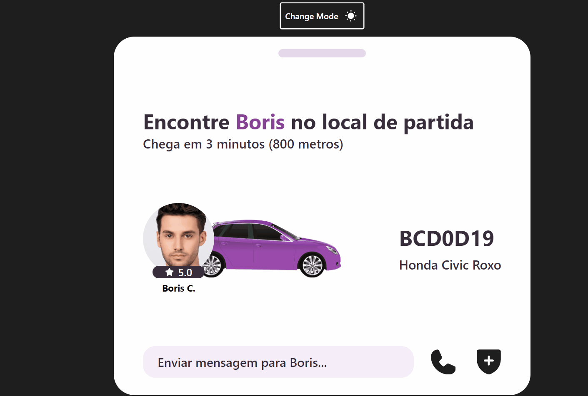

<h1 align="center"> #19  Widget Transporte </h1>

<p align="center">
  <a href="#-getting-started">Como começar?</a>&nbsp;&nbsp;&nbsp;|&nbsp;&nbsp;&nbsp;
  <a href="#-tecnologias">Tecnologias</a>&nbsp;&nbsp;&nbsp;|&nbsp;&nbsp;&nbsp;
  <a href="#-o-projeto">Projeto</a>&nbsp;&nbsp;&nbsp;|&nbsp;&nbsp;&nbsp;
  <a href="#-resultado">Resultado</a>&nbsp;&nbsp;&nbsp;|&nbsp;&nbsp;&nbsp;
  <a href="#-indo-além">Indo Além</a>&nbsp;&nbsp;&nbsp;|&nbsp;&nbsp;&nbsp;
  <a href="#-creators">Creators</a>&nbsp;&nbsp;&nbsp;|&nbsp;&nbsp;
</p>

<p align="center" id="-layout">
  
</p>

## 👀 Getting Started

Para começar, no terminal do seu editor de código podemos clonar o repositório do projeto digitando o seguinte:

```bash
git clone https://github.com/EdsonGomesJR/boracodar19-widget-transporte.git

```
Depois de clonar o projeto, precisaremos instalar as dependências, com o seguinte comando:
```bash
npm install
# ou 
yarn add
```
Terminando o processo de instalação, estaremos prontos para iniciar o projeto utlizando os comandos :
```bash
npm run dev
# ou
yarn dev
```

## 🏆 Tecnologias

Esse projeto foi desenvolvido com as seguintes tecnologias:
- HTML
- CSS
- TailwindCSS
- NextJs
- JavaScript
- React
- Git e Github
- Figma

## 💻 O Projeto


O  **_Widget Transporte_** é o **#19** projeto do desafio semanal da RocketSeat, estes desafios servem para estimular a comunidade a aprender e rever conceitos, lógicas e metódos utilizados para resolver problemas/situações que acontecem no dia-a-dia de um programador, assim como aumentar o portifólio  com a criação de interfaces, componentes e sistemas funcionais.


 ### Layout Proposto

O layout inicial do pojeto foi fornecido pela equipe de designers da RocketSeat e pode ser acessado no seguinte link do **[Figma](https://www.figma.com/community/file/1238132190532383264)**. A primera parte do desafio consiste em replicar a interface proposta como na imagem abaixo.

<div align="center">
   
</div>


## 🔖 Resultado 

Nesse desafio foram utilizadas as propriedades **relative** e **absolute** do CSS, assim posicionamos a imagem do carro junto com a foto do motorista, no caso para a foto do motorista ficar a frente usamos o **z-index** e assim vemos layout finalizado:

<p align="center" id="-layout-figma">
  
</p>

## 🚀 Indo Além

Em todos desafios temos a proposta de "irmos além", ou seja, não focar apenas em replicar o layout, mas adicionar alguma funcionalidade extra ao projeto.

### DarkMode

Neste projeto foi adicionado o modo "dark", alterando as cores bases entre light e dark do projeto. Utilizando o localStorage para salvar as preferências dos usuários e salvar o tema escolhido.
Foram inseridos icones no botão de troca de tema, esses icones são no formato svg animados. 

<p align="center" id="-layout-figma">
  
</p>


## 📃 Creators

This challange was made with love by Edson
                                                             

